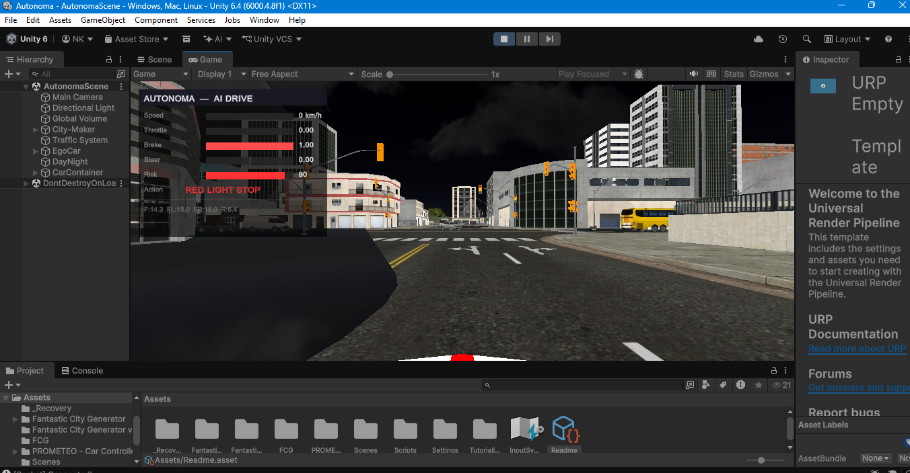
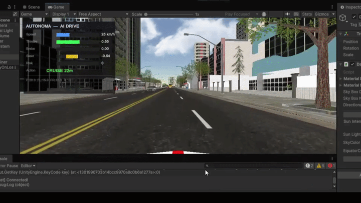
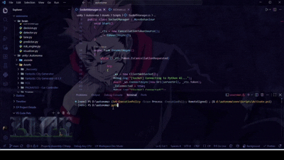
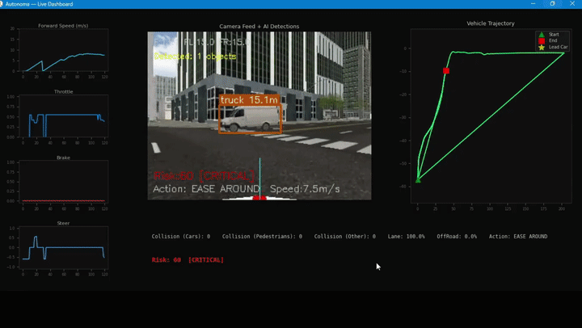
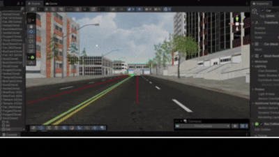
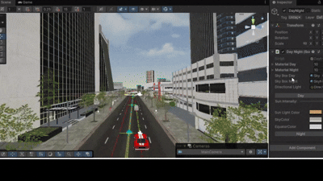
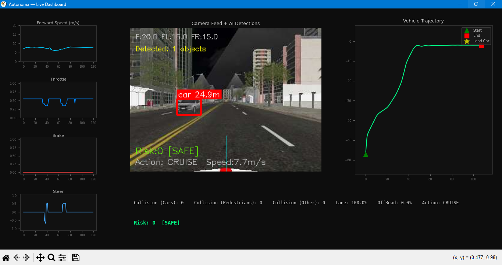
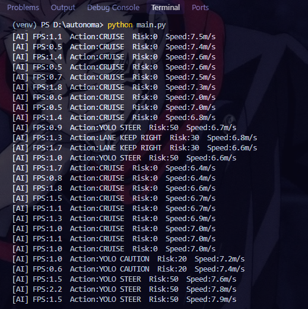

# AUTONOMA — Autonomous Vehicle Simulation System


A real-time autonomous driving simulation combining a Unity 3D city environment with a Python computer-vision brain. A simulated vehicle perceives its surroundings through YOLOv11 object detection and physics raycasts, then makes driving decisions through a transparent, priority-based rule engine — no black-box end-to-end model, every decision is traceable and explainable.

<p align="center">
  
</p>

### Demo

<p align="center">
  <b>Main walkthrough</b><br/>
  
</p>

<p align="center">
  <b>Backend / AI brain startup</b><br/>
  
</p>

<p align="center">
  <b>Live dashboard — detection in action</b><br/>
  
</p>

<p align="center">
  <b>Autonomous navigation — turning</b><br/>
  
</p>

<p align="center">
  <b>Day/night camera views</b><br/>
  
</p>

<p align="center">
  <b>Dashboard layout (reference)</b><br/>
  
</p>

---

## Table of Contents

- [Overview](#overview)
- [System Architecture](#system-architecture)
- [How It Works](#how-it-works)
- [Communication Protocol](#communication-protocol)
- [Setup & Running](#setup--running)
- [Results](#results)
- [Known Limitations](#known-limitations)
- [Future Work](#future-work)
- [Project Structure](#project-structure)
- [Credits & Third-Party Assets](#credits--third-party-assets)

---

## Overview

AUTONOMA implements a complete autonomous driving pipeline following the classic **See → Understand → Predict → Decide → Act** framework used across real-world AV systems (Tesla Autopilot, Waymo, CARLA-based research):

1. **See** — 8-directional physics raycasts for 360° spatial awareness, plus a live camera feed (320×240 @ ~12 FPS)
2. **Understand** — YOLOv11s detects and classifies cars, trucks, buses, pedestrians, motorcycles, bicycles, traffic lights, and stop signs
3. **Predict** — Distance to each detected object is estimated using focal-length geometry
4. **Decide** — A 9-tier priority engine resolves emergency stops, obstacle dodging, traffic-signal compliance, and lane keeping — deterministically, not via a learned policy
5. **Act** — Resolved throttle/brake/steer commands drive a physics-based vehicle controller in real time

**Why a rule-based decision engine instead of end-to-end deep learning?** Transparency and debuggability. Every driving decision in AUTONOMA can be traced to an exact triggering condition — useful both as a learning tool for understanding AV decision logic, and as a foundation that could later be swapped for a learned policy (see [Future Work](#future-work)) while keeping the same perception and control layers intact.

Unity acts as the simulation client — physics, rendering, sensing. Python acts as the AI server — perception and decision-making. They communicate over a local WebSocket connection.

---

## System Architecture

| Component | Technology | Role | Output |
|---|---|---|---|
| Unity 3D | C# | Simulation environment, physics, sensing | Sensor data + camera frames |
| `RaycastSensor.cs` | Unity Physics | 8-ray, 360° distance sensing | Distances per direction |
| `EgoCarWaypointDriver.cs` | Unity | Waypoint-based road navigation | Steering toward next waypoint |
| `SocketManager.cs` | C# WebSocket client | Unity ↔ Python bridge | JSON messages over WebSocket |
| `main.py` | Python / asyncio / websockets | AI server, pipeline orchestration | Control commands |
| YOLOv11s | Python / Ultralytics | Real-time object detection | Bounding boxes + estimated distance |
| `brain/decision.py` | Python | Priority-based rule engine | throttle / brake / steer |
| `brain/visualizer.py` | Matplotlib (TkAgg) | Real-time telemetry dashboard | Live graphs, camera overlay, trajectory |

---

## How It Works

### Perception — Raycast Sensing

`RaycastSensor.cs` casts 8 physics rays from the vehicle's center, 0.6m above ground:

| Ray | Angle | Range | Purpose |
|---|---|---|---|
| Front | 0° | 20m | Primary obstacle detection |
| Front-Left / Front-Right | ±30° | 15m | Early side warning |
| Hard-Left / Hard-Right | ±70° | 8m | Tight clearance check |
| Left-Lane / Right-Lane | ±90° | 8m | Boundary detection |
| Rear | 180° | 10m | Reverse safety check |

Traffic-light state is read via a `Stop` collider convention from the Fantastic City Generator's traffic system — when active, the sensor flags `redLightAhead`.

### Perception — Object Detection

YOLOv11s runs on each incoming camera frame at a confidence threshold of 0.35–0.55, detecting 8 relevant classes. Distance to each detected object is estimated via:

```
distance = (real_object_width × focal_length) / pixel_width
```

Focal length is calibrated to 554.0 px for the 320×240 capture resolution; real-world widths are pre-defined per class (e.g. 1.8m for cars, 0.5m for pedestrians). Detections are sorted nearest-first so the closest threat is always evaluated first.

### Decision Engine

Higher-priority rules always override lower ones — a deliberate design choice for predictability:

| # | Scenario | Trigger | Action |
|---|---|---|---|
| 1 | Pedestrian emergency | < 8m | Full brake |
| 2 | Red light | `Stop` collider active | Full brake |
| 3 | Fully blocked | Front & both sides < threshold | Reverse, or wait if boxed in |
| 4 | Hard-blocked front | < 10m | Hard steer to open side |
| 5 | Ease around | < 16m | Gradual steer + slight slowdown |
| 6 | Lane keeping | Side clearance < 5m | Steer nudge away from boundary |
| 7 | YOLO vehicle avoidance | Detected car/truck/bus within range | Distance-scaled avoid/steer/caution |
| 8 | Stuck escape | < 0.8 m/s for > 2.5s | Reverse or rock-forward maneuver |
| 9 | Cruise | Clear road | Follow waypoint path |

**Dodge-direction scoring:** when avoidance requires a left/right choice, the engine sums three rays per side (`front + hard + lane`) and picks the side with greater total clearance — more robust than comparing a single ray, since it accounts for the full geometry of the open space, not just the nearest point.

### Vehicle Control

`PrometeoCarController` (extended with a custom `SetAIInputs()` method) applies throttle/brake torque to all four `WheelColliders` and steering via `Lerp` for smooth transitions. A safety clamp guarantees throttle and brake are never both applied above 0.1 simultaneously — avoiding erratic physics from conflicting inputs.

### Live Dashboard

A Matplotlib (TkAgg) window renders in real time: forward speed, throttle, brake, and steer as time-series graphs; the camera feed with YOLO bounding boxes and distance labels overlaid; a live vehicle trajectory map; and a status bar with collision counts, lane-adherence percentage, current action, and risk level. State is shared between the WebSocket thread and the dashboard thread via a lock-protected `DashboardState` class.

### Sample AI Brain Output

```
[AI] FPS:1.1  Action:CRUISE       Risk:0   Speed:7.5m/s
[AI] FPS:0.9  Action:YOLO STEER   Risk:50  Speed:6.7m/s
[AI] FPS:1.3  Action:LANE KEEP RIGHT  Risk:30  Speed:6.8m/s
[AI] FPS:1.0  Action:YOLO CAUTION Risk:20  Speed:7.2m/s
```


Each line is logged once per second, showing the currently resolved action, decision-engine risk score, live inference FPS, and vehicle speed — this is the same reasoning visible in real time on the dashboard, in plain-text form for quick debugging without the GUI open.

---

## Communication Protocol

Unity and Python communicate over a WebSocket on `localhost:9090`, exchanging messages roughly every 80ms (~12 FPS):

**Unity → Python:**
```json
{
  "frame": "<base64-encoded JPEG, 320x240>",
  "state": {
    "front_dist": 14.3, "front_left_dist": 15.0, "front_right_dist": 15.0,
    "speed_ms": 7.7, "red_light": false, "pos_x": 0.48, "pos_y": 0.98
  }
}
```

**Python → Unity:**
```json
{
  "throttle": 0.55, "brake": 0.0, "steer": 0.0,
  "action": "CRUISE", "risk_score": 0.0, "risk_level": "SAFE", "det_count": 1
}
```

---

## Setup & Running

**Requirements:** Python 3.10+, Unity `6000.4.8f1`, Windows.

**Manual start (two terminals/windows):**

```bash
git clone https://github.com/NidaKhaan/autonoma.git
cd autonoma
python -m venv venv
venv\Scripts\activate
pip install -r requirements.txt
python main.py
```

YOLOv11s weights are **not bundled** in this repo — `ultralytics` downloads `yolo11s.pt` automatically on first run.

Once `main.py` prints `Waiting for Unity on port 9090...`, open `unity/Autonoma/` in Unity Hub and press Play. The live dashboard opens automatically; Unity connects to the running Python server.

`launch.bat` automates venv activation and starts `main.py` for you — run it instead of the manual `venv\Scripts\activate` + `python main.py` steps above. You still open Unity yourself.

> **Third-party Unity assets required, not bundled in this repo:**
> - [Fantastic City Generator](#) (paid) — city environment, road network, traffic system
> - [Prometeo Car Controller](#) (free) — vehicle physics
>
> Import both into `unity/Autonoma/Assets/` before opening the scene.

---

## Results

- Autonomous navigation through a full procedurally-generated city, including intersection turns
- Reliable obstacle avoidance across near/mid/far distance zones
- Traffic-light compliance via collider-based red-light detection
- YOLOv11s inference on CPU (Intel i5-6440HQ, no CUDA available) starts around ~1 FPS immediately after launch during model warmup, then climbs and stabilizes in the 10–12 FPS range as the pipeline runs
- GPU inference was not benchmarked on this hardware but is expected to substantially increase throughput given the CPU-bound nature of the current bottleneck


---

## Known Limitations

- Camera-based detection carries ~80–100ms latency; fast-approaching obstacles rely on raycast response rather than YOLO
- Distance estimation accuracy degrades beyond ~20m (pixel-resolution limits)
- Traffic-light detection depends on the Fantastic City Generator's `Stop` collider naming convention — won't generalize to other traffic systems
- `SocketManager.cs`'s receive loop assumes single-fragment WebSocket messages (doesn't check `EndOfMessage`); safe at the current 320×240 frame size, but needs a proper multi-fragment read before increasing resolution
- No CUDA on the test GPU — inference is CPU-bound, with a noticeable warmup period (~1 FPS) immediately after startup before stabilizing

## Future Work

- Reinforcement learning-based decision layer (Unity ML-Agents) as an alternative to the rule engine
- Multi-camera fusion for wider field of view
- Simulated LiDAR-style depth sensing
- Proper WebSocket message framing to support higher-resolution frames

---

## Project Structure

```
autonoma/
├── main.py                  # WebSocket server + pipeline orchestration
├── brain/                   # Detection, decision, risk, visualization modules
├── unity/Autonoma/           # Unity project
│   └── Assets/Scripts/       # AIDriver, RaycastSensor, SocketManager, etc.
├── requirements.txt
└── launch.bat
```

---


## Credits & Third-Party Assets

- [Ultralytics YOLOv11](https://docs.ultralytics.com)
- Fantastic City Generator(https://assetstore.unity.com/packages/3d/environments/urban/fantastic-city-generator-157625?srsltid=AfmBOor8JeSilVjDWfEFBB6dlfeOQaRLs1C3hZzSB0GlR1vWENx7C1wY) — Unity Asset Store (paid, not redistributed here)
- Prometeo Car Controller(https://assetstore.unity.com/packages/tools/physics/prometeo-car-controller-209444?srsltid=AfmBOorpxaAH9CCb6CiS0D7LwCHzM0QD9q4J37zMD2NZltRm_e0NOME3) — Unity Asset Store (free, not redistributed here)

## Author

**Nida Sheraz** 


